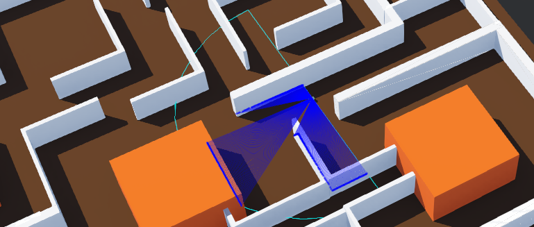

# Motion planning and target searching in complex environments

This repository contains the presentation of the Robotics exam project of the Master's Degree in Computer Engineering at the University of Palermo. The showcased works consists in the construction, programming, and simulation of a robot that uses the information coming from its surrounding environment to navigate to a target location through a complex environment. The robot mainly relies on the wheels' position sensors and LIDAR devices to navigate through a maze and avoid obstacles using the surrounding walls as reference points. Once out of the maze, the simulation is designed to trigger the Simultaneous Localization And Mapping (SLAM) mode, where the robot is capable of evaluating the path to follow according tho the video feedback of the camera mounted on it, which localizes and outlines a track through the detection of known landmarks within its field of view. Each of the modes (aiming at the target, avoiding obstacles, and SLAM) is also autonomously computed, as is the strategy that triggers the mode to be activated based on the robot's state and its surroundings.

Below, a sample run of the presented procedure within the Webots robot simulation software:

https://user-images.githubusercontent.com/38737837/203834741-641f5cd6-f819-45c9-92bb-1b6501092295.mp4

